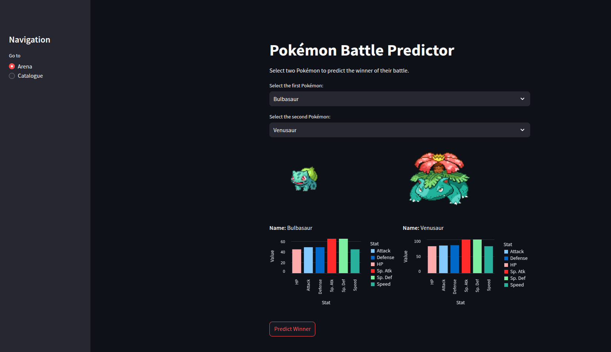
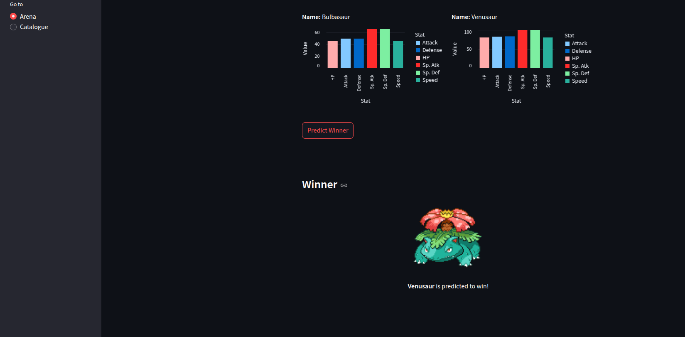
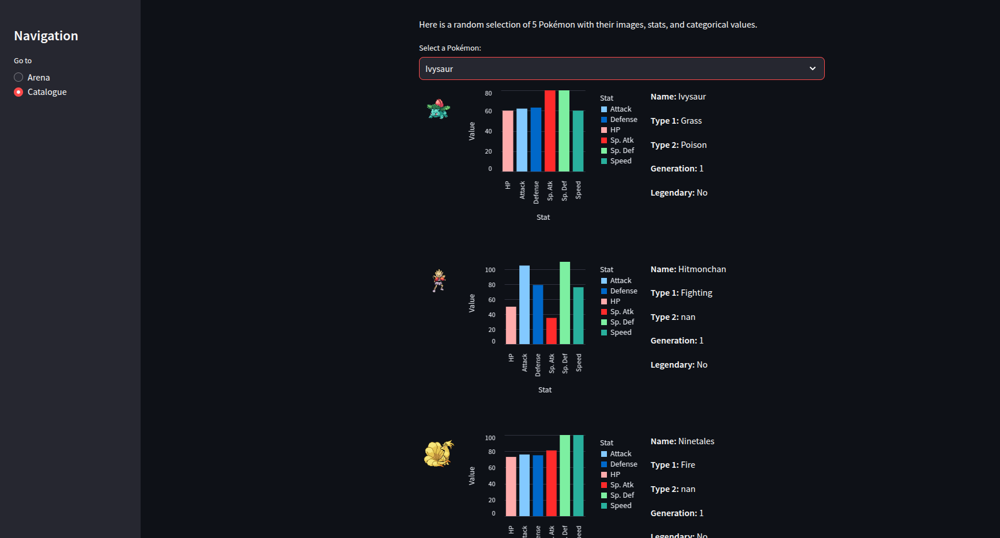

# 🧠 Pokémon Battle Outcome Prediction

Welcome to my Pokémon Battle Prediction project! This repository features a machine learning pipeline built using the **Weedle’s Cave dataset** and trained with an **XGBoost model**. It also includes a fully functional **web application** where you can simulate Pokémon battles!

You can also check out the [Kaggle notebook here](https://www.kaggle.com/datasets/terminus7/pokemon-challenge).

---

## 📁 Dataset

The model is trained using the **Weedle’s Cave Pokémon Battle Dataset**:
- 📂 [Weedle’s Cave Dataset on Kaggle](https://www.kaggle.com/datasets/terminus7/pokemon-challenge)

**Description**:
> Welcome to Weedle’s Cave! Predict the outcome of future matches using Pokémon characteristics and the results of previous combats.  
> - The dataset contains Pokémon stats and battle outcomes.  
> - Goal: Train a machine learning model to predict winners of future battles.

---

## 📊 Exploratory Data Analysis (EDA) Insights

- **🛡️ Attack vs. Defense**: Moderate positive correlation – strong Pokémon often have balanced offense and defense.
- **⚡ Speed**: Positively correlates with Attack, but negatively with HP/Defense. Fast Pokémon tend to be glass cannons.
- **🌟 Legendary Status**: Strongly correlates with high base stats, affirming the superior strength of Legendary Pokémon.

---

## 🔍 Modeling Insights

- **🚀 Faster Pokémon Have the Edge**  
  Speed gives strategic advantage. Striking first can significantly affect the battle outcome.

- **🔠 Categorical Features > Numeric Differences**  
  Models like **XGBoost** and **LightGBM** outperformed others, as they leverage categorical features (e.g., type, legendary status) more effectively than raw numerical stats.

- **🌲 Tree-Based Models Excel**  
  Tree-based models were able to capture type advantages and complex interactions better than simpler models like logistic regression.

---

## 🧪 Baseline Modeling Results

Initial models tested:
- Logistic Regression
- XGBoost ✅ (Best)
- CatBoost
- LightGBM

**Best Baseline Model**:  
- **Validation Accuracy**: `0.9618`  
- **F1 Score**: `0.96`

XGBoost was selected as the final model due to its superior performance and interpretability.

---

## 🧬 Feature Engineering & Hyperparameter Tuning

### 🔧 Experiments

| Experiment | Description | Val Acc | F1 Score |
|-----------|-------------|---------|----------|
| 1 | Removed Generation Info | 0.9604 | 0.96 |
| 2 | Added Stat Differences as Features ✅ | 0.9637 | 0.97 |
| 3 | Kept Only Stat Differences | 0.9617 | 0.96 |
| 4 | Added "Is One Side Legendary?" Feature | 0.9623 | 0.96 |

### ⚙️ Hyperparameter Tuning

Used **GridSearchCV** on 5 folds and 72 parameter sets (360 fits total):  
**Best Parameters**:
```json
{
  "colsample_bytree": 1.0,
  "learning_rate": 0.2,
  "max_depth": 7,
  "n_estimators": 200,
  "subsample": 1.0
}
```
- **Best Cross-Validation Accuracy**: `0.96685`

---

## ✅ Final Results on Test Set

| Metric | Class 0 | Class 1 |
|--------|---------|---------|
| Precision | 0.97 | 0.96 |
| Recall | 0.96 | 0.96 |
| F1-Score | 0.97 | 0.96 |
| **Test Accuracy** | **0.9646** |

---

## 🌐 Web App

We developed a **Streamlit web app** with two pages:

### ⚔️ Arena
Pick 2 Pokémon and predict the winner!

  


### 📘 Catalogue
View stats of 5 random Pokémon.



### 🔗 [Try the App Online](https://barkinsagan-pokemon-fight-prediction-app-cnnaoc.streamlit.app/)

To run locally:
```bash
streamlit run app.py
```

---

## 📝 Notes

- Some scripting was automated using AI tools, but all insights, modeling logic, and deductions are my own.
